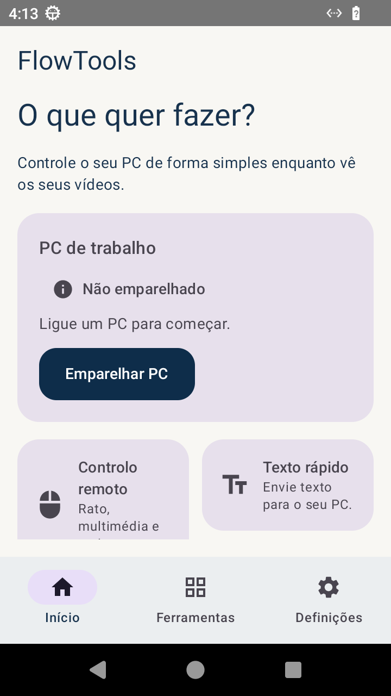
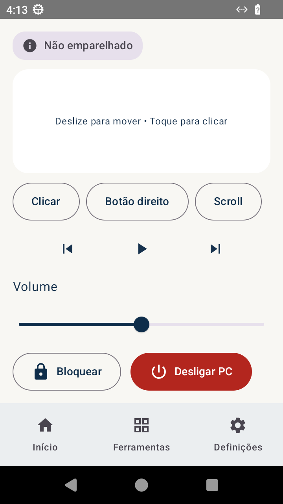
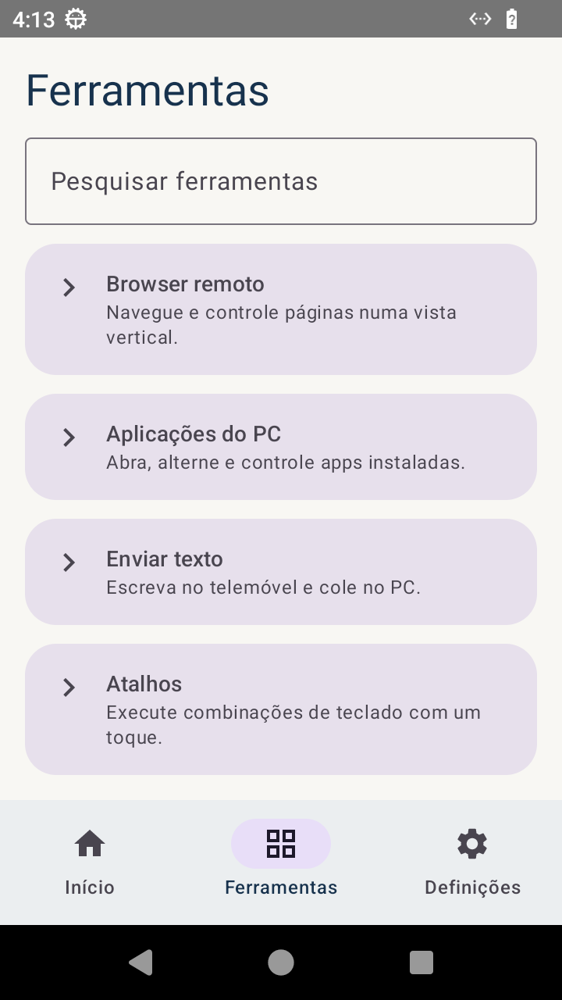
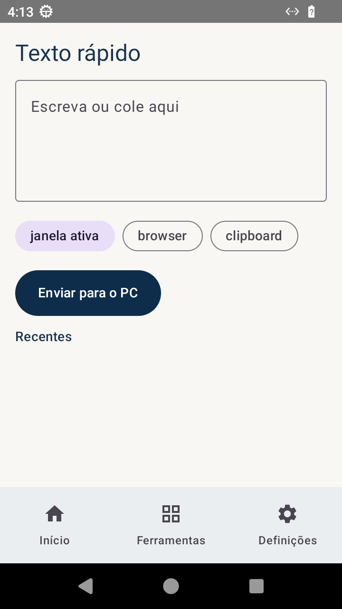
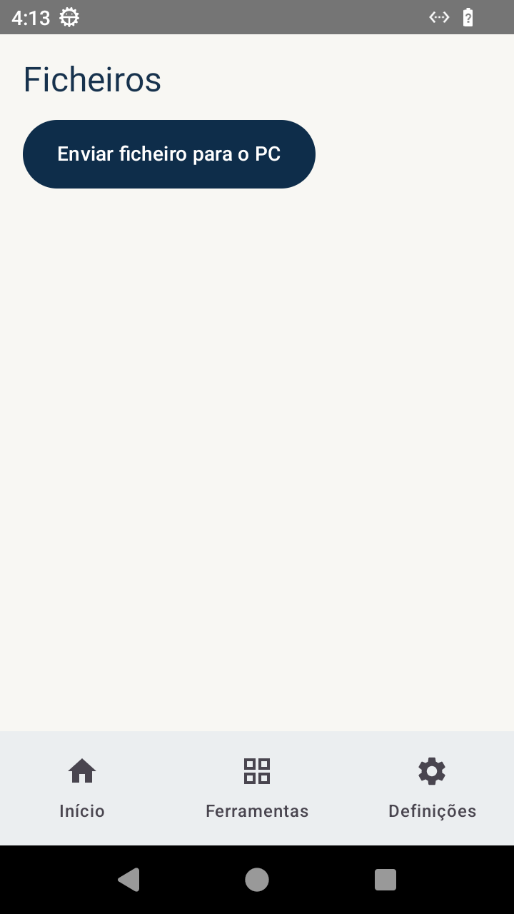
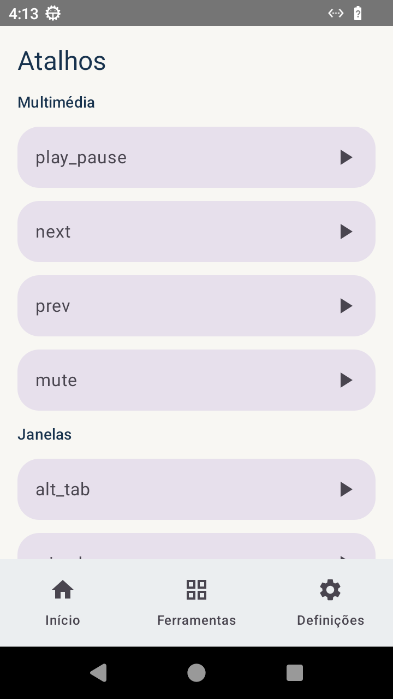
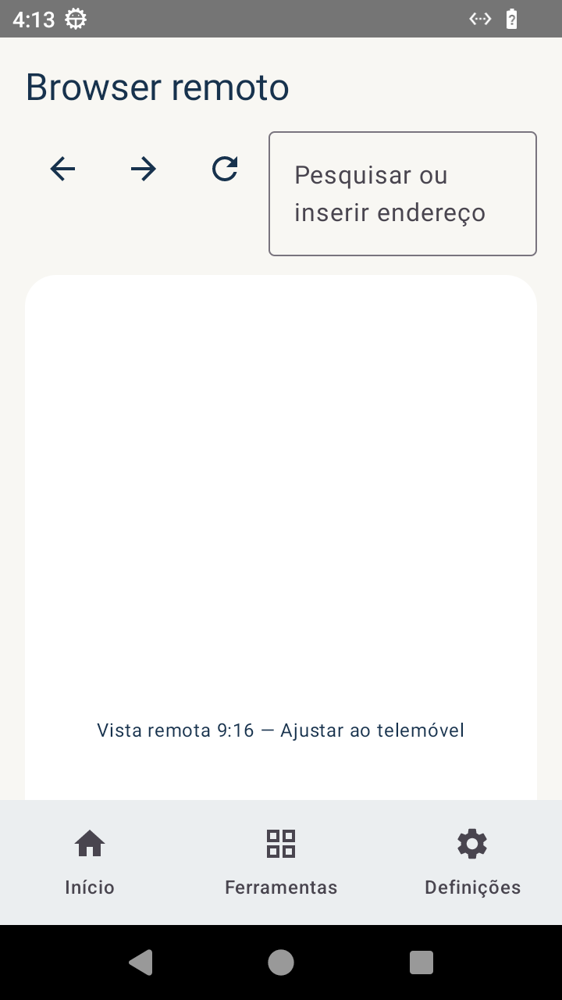
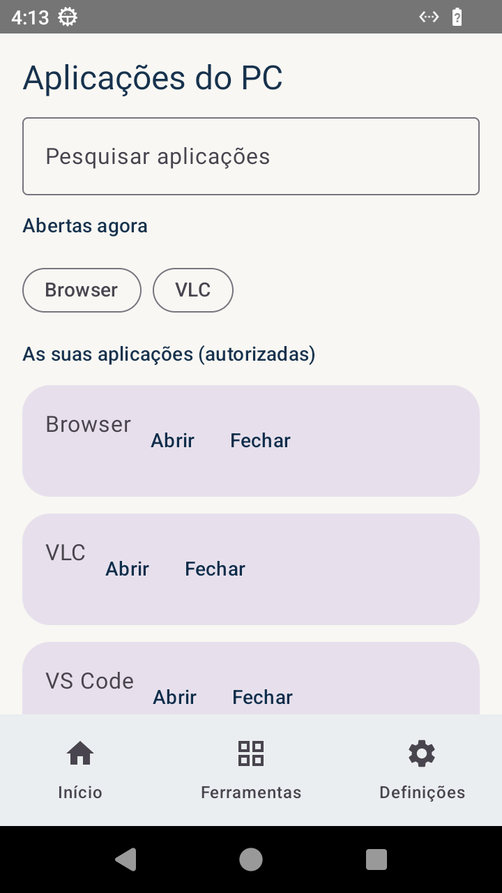
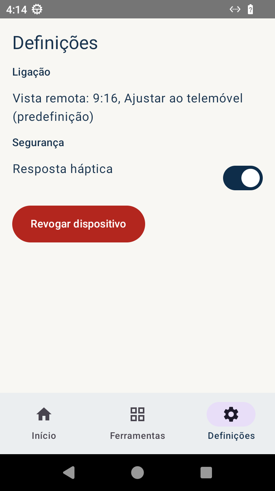
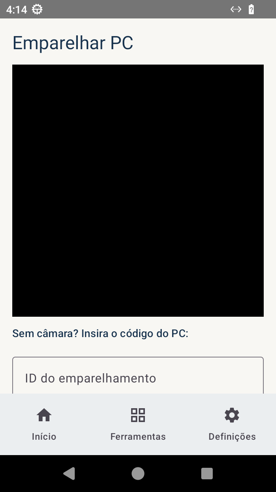

# FlowTools — O teu PC, mais perto.

Suíte de ferramentas para Android que permite controlar o PC, o browser e
outras aplicações do computador a partir do telemóvel, sem pausar o vídeo
que estás a ver nem sair da aplicação atual.

> **Queres só usar?** Não precisas de Rust, cargo, JDK ou Android SDK.
> Vai a **Releases** (geradas por CI em cada tag `v*`) e saca:
> `flowtools-pc_*_amd64.deb`, `flowtools-server_*_amd64.deb` e
> `app-release.apk` (assinado). Instalação em 5 minutos — ver secção 1.

Três componentes:

| Componente | Pasta | Tecnologia |
|---|---|---|
| Servidor de sessão (pairing, auth, relay, inbox de ficheiros) | `crates/server` | Rust + Axum + Tokio |
| Client do PC (input, captura, apps, browser, ficheiros) | `crates/pc-client` | Rust (enigo, xcap) |
| App Android (UI, gestos, pairing, socket) | `android/` | Kotlin + Jetpack Compose + Material 3 |
| Contrato partilhado (estados, eventos WS, erros) | `crates/protocol` | Rust (espelhado em Kotlin) |

Especificação visual e funcional: `flowtools-ui-ux.md` e
`flowtools-ui-spec.json`. Conceito visual: `flowtools-ui-concept.png`.

## Ecrãs (capturas reais em Redroid 720×1280)

| Início | Controlo remoto | Ferramentas |
|---|---|---|
|  |  |  |

| Texto rápido | Ficheiros | Atalhos |
|---|---|---|
|  |  |  |

| Browser remoto (9:16) | Aplicações do PC | Definições |
|---|---|---|
|  |  |  |

Emparelhamento (QR + código manual):


---

## 1. Instalação (sem toolchain — via Releases)

Pré-requisito: telemóvel e PC na **mesma rede local**.

### 1.1. Servidor (no PC que queres controlar, ou outro PC da rede)

```bash
sudo apt install ./flowtools-server_*_amd64.deb
sudo systemctl enable --now flowtools-server
curl http://127.0.0.1:8787/v1/health
# {"ok":true,"relay_enabled":false,"version":"1.0.0"}
```

Configuração: `/etc/default/flowtools-server` (porta `PORT`, relay
`FLOWTOOLS_RELAY`). Logs: `journalctl -u flowtools-server -f`.
Remover: `sudo apt remove flowtools-server`
(limpeza total: `sudo apt purge flowtools-server`).

### 1.2. Client do PC (no PC que queres controlar)

```bash
sudo apt install ./flowtools-pc_*_amd64.deb
# Opcionais (multimédia/volume, clipboard, foco de janelas):
sudo apt install playerctl pulseaudio-utils wl-clipboard xclip wmctrl
```

O `.deb` instala o binário em `/usr/bin/flowtools-pc` e uma unidade
**de utilizador** do systemd. Para arrancar automaticamente na sessão
gráfica:

```bash
systemctl --user enable --now flowtools-pc
journalctl --user -u flowtools-pc -f   # ver o código QR + código temporário
```

Se o servidor não estiver no próprio PC, edita o endereço:
`systemctl --user edit flowtools-pc` e define
`Environment=FLOWTOOLS_SERVER=http://IP-DO-SERVIDOR:8787`,
depois `systemctl --user restart flowtools-pc`.

Arranque manual (ver o QR no terminal):

```bash
flowtools-pc --server http://127.0.0.1:8787 --pc-name "PC de trabalho"
```

O client mostra um **QR legível de verdade** em 3 formas (escolhe a que
der jeito):

1. **No terminal** — QR em blocos, pronto a ler (funciona até por SSH);
2. **PNG** em `/tmp/flowtools-pair-<id>.png` — abre no visor de imagens;
3. **Página HTML** em `/tmp/flowtools-pair-<id>.html` — abre no browser
   do PC (o client tenta abrir sozinho em sessão interativa) e lê com
   o telemóvel. Traz o QR grande + código + endereço do servidor.

O QR já inclui o endereço do servidor (`host=`): se o `--server` for
`localhost`, o client deteta o IP LAN da máquina e usa-o no QR e no
texto "Endereço para o telemóvel". Se correres o servidor noutra
máquina, passa o endereço LAN em `--server` e ele segue intacto.

Remover: `sudo apt remove flowtools-pc`.

### 1.3. Hotspot do telemóvel (sem Wi-Fi por perto)

Sim, funciona: o hotspot **é** uma rede local.

1. Liga o **ponto de acesso** no telemóvel e conecta o PC a ele.
2. No PC, descobre o IP que o hotspot lhe deu:
   `hostname -I` (tipico `192.168.43.x` em Android, `172.20.10.x` em iPhone).
3. Garante que a firewall deixa passar a porta:
   `sudo ufw allow 8787/tcp` (só se o `ufw` estiver ativo).
4. Arranca `flowtools-pc` — o QR já traz esse IP; na app é só ler.
   Se o servidor correr noutro PC da mesma rede, usa
   `--server http://IP-DESSE-PC:8787`.

### 1.3. App Android

1. Saca `app-release.apk` da Release e instala
   (`adb install app-release.apk`, ou copia para o telemóvel e abre).
2. Abre a app → **Emparelhar PC**.
3. Lê o QR mostrado pelo client do PC (ou insere ID + código + endereço;
   no telemóvel usa o **IP LAN** do PC, ex. `http://192.168.1.5:8787`).
4. Desmarca capacidades que não quiseres autorizar e toca
   **Autorizar selecionadas**. O token fica no Keystore e roda a cada
   ligação. Revogar: **Definições → Revogar dispositivo**.

---

## 2. O que a v1 faz

- **Início:** cartão do PC (nome + estado por texto e ícone), 4 ações
  rápidas (controlo remoto a **1 toque**), recentes.
- **Controlo remoto:** touchpad grande (1 dedo move, toque clica,
  2 dedos = botão direito/scroll), botões alternativos acessíveis,
  anterior/play·pause/seguinte, volume, **Bloquear** imediato e
  **Desligar PC com confirmação**.
- **Browser remoto:** barra de endereço (voltar/avançar/recarregar),
  viewport vertical **9:16** em "Ajustar ao telemóvel" por defeito,
  pinça para zoom + botões +/−, "Abrir browser no PC".
- **Aplicações do PC:** só apps **autorizadas**, abrir/focar/fechar,
  viewport 9:16, barra flutuante recolhível.
- **Texto rápido:** janela ativa / browser / clipboard, histórico
  opt-in (nada sensível guardado por defeito).
- **Atalhos** por categoria (multimédia, janelas, browser, edição, sistema).
- **Ficheiros:** envio telemóvel→PC com progresso e cancelamento,
  destino `~/Downloads/FlowTools`, **nunca substitui sem confirmação**
  (devolve `file_exists`), máx. 50 MB.
- **Estados de ligação** sempre visíveis com texto + ícone:
  Não emparelhado · A ligar · Ligado · A reconectar · Offline ·
  Permissão necessária. Reconnect com backoff preserva a ferramenta.

## 3. Segurança (baseline v1)

Pairing com código/QR de uso único · tokens rotativos · token Android no
Keystore · permissões granulares por capacidade · revogação com efeito
imediato · timeout de sessão 8h · indicador visível no PC
(`notify-send` + consola) enquanto a sessão está ativa · confirmação
para desligar e para substituir ficheiros · allow-list de apps ·
mensagens de erro PT sem detalhes técnicos (sem sockets/exceções na UI).

> **HTTP local (cleartext):** a app fala `http://`/`ws://` com o servidor
> na rede local indicada pelo utilizador, por isso o manifest declara
> `usesCleartextTraffic="true"` (sem isto, o Android 9+ bloqueia tudo
> com "CLEARTEXT not permitted", mesmo com a rede OK). A app só contacta
> o host do pairing — nunca terceiros. TLS com certificado próprio fica
> para a v2.

## 4. Erros que a app mostra (e o que fazer)

| Mensagem | Causa provável | Ação |
|---|---|---|
| O PC não está disponível. | Servidor/PC offline | Verificar rede e `systemctl` |
| A sessão expirou. | Token rodado após reconnect | Voltar a ligar / re-emparelhar |
| Esta ferramenta precisa de autorização. | Capacidade não aprovada | Rever permissões no pairing |
| Código inválido. | Erro de digitação | Tentar de novo |
| O código expirou. | Passaram 5 min | `systemctl --user restart flowtools-pc` |
| Já existe um ficheiro com esse nome. | Duplicado no destino | Renomear antes de enviar |
| Ficheiro demasiado grande (máx. 50 MB). | Limite da inbox | Dividir/comprimir |
| O browser não está aberto no PC. | — | "Abrir browser no PC" |

---

## 5. Desenvolver a partir do fonte

### 5.1. Requisitos da toolchain

- Rust estável (`rustup`), `pkg-config` + libs para `enigo`/`xcap`:
  `libssl-dev libwayland-dev libxkbcommon-dev libx11-dev libxtst-dev
  libpipewire-0.3-dev clang libegl-dev libgl-dev`.
- JDK 17, Android SDK (platform 34, build-tools 34), Gradle 8.10+
  (`android/local.properties` com `sdk.dir`).

### 5.2. Correr em modo dev

```bash
cargo run -p flowtools-server                       # :8787 (PORT para mudar)
cargo run -p flowtools-pc -- --server http://127.0.0.1:8787
export ANDROID_SDK_ROOT=/opt/android-sdk JAVA_HOME=/usr/lib/jvm/java-17-openjdk-amd64
gradle :app:assembleDebug                            # em android/
adb install -r app/build/outputs/apk/debug/app-debug.apk
```

### 5.3. Testes

```bash
cargo fmt --all --check && cargo test --workspace   # protocolo (6), servidor (4), PC (7)
gradle :app:testDebugUnitTest                       # Android (13): estados, permissões, JSON, QR
gradle :app:connectedAndroidTest                    # UI, com emulador/dispositivo
```

Bateria de erros contra um servidor local (24 casos: pairing, upload,
tickets one-shot, WS, rotação, revogação) + prova de duplicados:
`scripts/force_errors.py` (ver `scripts/README.md` se existir).

### 5.4. Gerar .debs localmente

```bash
cargo install cargo-deb --locked
cargo deb -p flowtools-pc       # target/debian/flowtools-pc_*_amd64.deb
cargo deb -p flowtools-server
dpkg-deb -c target/debian/*.deb # inspecionar conteúdo
```

---

## 6. CI/CD e releases

Workflow **CI** (`.github/workflows/ci.yml`): em cada push/PR —
`cargo fmt --check`, `cargo test`, testes unitários Android e APK debug
(como artefacto).

Workflow **Release** (`.github/workflows/release.yml`): em cada tag
`v*` — compila os dois `.deb`, o APK + AAB release e publica tudo na
GitHub Release:

```bash
git tag v1.0.0 && git push origin v1.0.0
```

### 6.1. APK/AAB assinados no CI (uma vez)

O utilizador **não** precisa disto; só quem publica releases:

```bash
keytool -genkeypair -v -keystore flowtools-release.jks -alias flowtools \
  -keyalg RSA -keysize 2048 -validity 10000
base64 -w0 flowtools-release.jks   # guardar o .jks fora do repo!
gh secret set ANDROID_KEYSTORE_BASE64 --body "$(base64 -w0 flowtools-release.jks)"
gh secret set ANDROID_KEYSTORE_PASSWORD --body "…"
gh secret set ANDROID_KEY_ALIAS --body "flowtools"
gh secret set ANDROID_KEY_PASSWORD --body "…"
```

Com os secrets definidos, o build de release é assinado e verificado
com `apksigner verify`. Sem secrets, o workflow publica na mesma os
`.deb` e o APK de debug, avisando que o release vai sem assinatura.
Localmente, o mesmo fluxo usa `android/key.properties` (ignorado pelo
git — ver `build.gradle.kts`).

### 6.2. Tamanho do APK (e como manter baixo)

Medido na v1.0.0: APK universal **34,2 MB → 21,7 MB (−37%)**,
AAB **23,2 MB → 14,5 MB (−38%)**, com:

- R8 (`isMinifyEnabled`) + `shrinkResources` no build release;
- `resourceConfigurations += ["en", "pt"]` (corta locales das libs);
- regra `-dontwarn org.slf4j.**` (logging opcional das libs);
- keeps só para eventos de sessão, pairing e ViewModels.

O release com R8 é validado em dispositivo (Redroid) antes de cada
tag: instala, abre Início/pairing/controlo remoto sem crashes.

Alavancas futuras, por ordem de impacto:

1. **APKs por ABI** (`splits.abi`, só `arm64-v8a` + `armeabi-v7a`):
   o APK universal traz `.so` (CameraX, MLKit, DataStore) para todas
   as arquiteturas; por ABI poupa mais ~5–8 MB por APK. O AAB já faz
   isto sozinho na Play Store — só compensa para sideload.
2. **Scanner sem modelo embutido**: `barcode-scanning` traz o modelo
   MLKit no APK. Alternativa `play-services-code-scanner` (≈0 MB
   extra), à custa de exigir Google Play Services no telemóvel.
3. **Remover `material-icons-extended`** se os ícones usados couberem
   em `material-icons-core` (o R8 já remove os não usados; o ganho
   extra é só no tempo de build).
4. **WebP** nos PNGs de `docs/` não conta para o APK (só repo).

## 7. Limites conhecidos da v1

- Captura e input reais exigem sessão gráfica no PC (X11/Wayland);
  em headless a sessão continua ligada mas input/frames avisam com erro
  compreensível em vez de cair.
- Relay remoto é só flag (`FLOWTOOLS_RELAY=1`); sem TURN/STUN próprio.
- Um PC de cada vez; um monitor (primário); sem atalhos personalizados.
- Ficheiros só no sentido telemóvel→PC; texto do PC→telemóvel não.

## 8. Roadmap (v2)

Relay remoto com consentimento explícito · múltiplos PCs e monitores ·
macros/atalhos personalizados · notificações do PC · tray Tauri no
client · histórico sincronizado · download PC→telemóvel.

Licença: MIT (`LICENSE-MIT`).
