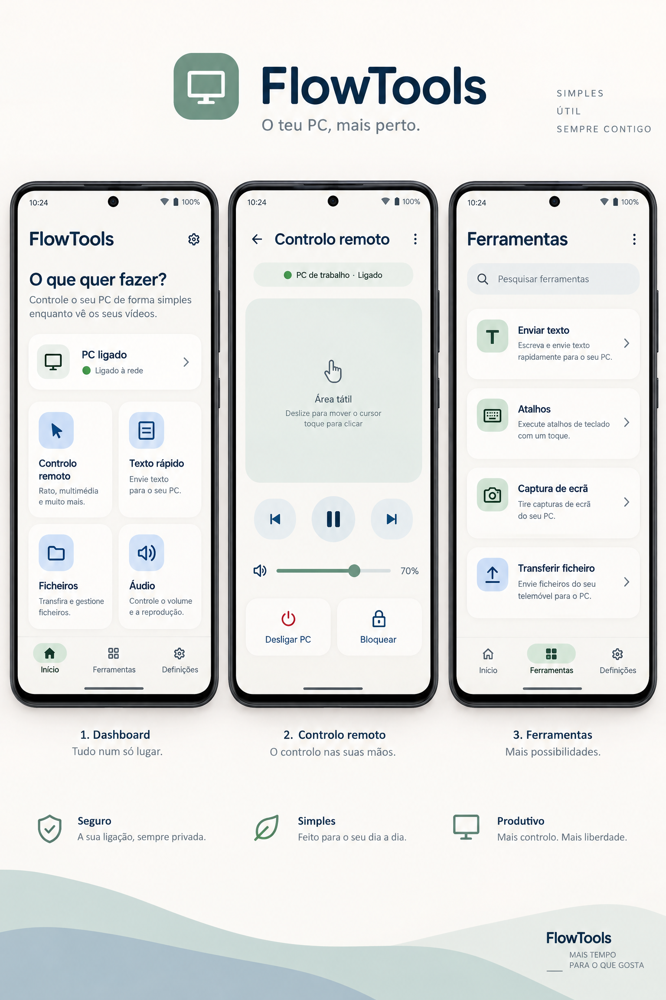

# FlowTools — Especificação final de UI/UX

**Versão:** 1.0 aprovada  
**Produto:** FlowTools  
**Plataforma:** Aplicação companion para Android ligada a um client no PC  
**Tagline:** *O teu PC, mais perto.*

## 1. Visão do produto

O FlowTools é uma suíte de ferramentas para Android que permite controlar um PC enquanto o utilizador continua a assistir a vídeos ou a executar outra atividade no telemóvel. A aplicação deve reduzir a necessidade de interromper o vídeo, trocar de dispositivo ou procurar comandos complexos no computador.

A experiência é composta por três partes. O **client Android** apresenta a interface e recebe gestos, texto e comandos. O **client do PC** executa as ações autorizadas, disponibiliza a lista de aplicações e envia uma vista remota. O **servidor de sessão** gere o pairing e o encaminhamento, dando prioridade a uma ligação local direta.

A interface aprovada é clara, calma e funcional. A estética usa superfícies quentes, azul-marinho para hierarquia, verde-sage para estados positivos e azul suave para ações interativas. Os cartões têm cantos arredondados e espaçamento generoso. O produto deve parecer uma ferramenta diária confiável, não um painel técnico ou uma interface cyberpunk.

## 2. Problema que a UX resolve

O utilizador quer consultar ou controlar algo no PC sem pausar o vídeo que está a assistir no telemóvel. Os casos mais importantes são controlar reprodução e volume, enviar texto, abrir ou alternar aplicações, navegar no browser, consultar notificações, transferir ficheiros e executar atalhos.

O princípio central é preservar o contexto. Ao entrar numa ferramenta, o utilizador não deve sentir que saiu de uma aplicação complexa para entrar noutra. Cada ecrã precisa de mostrar claramente a ligação atual, oferecer um caminho curto de regresso e manter os comandos frequentes visíveis.

## 3. Arquitetura de informação

A navegação principal usa três destinos persistentes:

| Destino | Função | Conteúdo principal |
|---|---|---|
| **Início** | Acesso rápido | Estado do PC, ações recentes e quatro ações prioritárias |
| **Ferramentas** | Descoberta | Browser remoto, aplicações, texto, atalhos, capturas, ficheiros e notificações |
| **Definições** | Gestão | Pairing, segurança, vista remota, aparência e preferências |

O estado da ligação deve aparecer no Início, nos ecrãs de controlo e nas vistas remotas. O estado não deve depender apenas de uma cor; deve incluir texto como “Ligado”, “A ligar”, “Offline” ou “Permissão necessária”.

## 4. Ecrãs principais

### 4.1 Início

O Início apresenta a pergunta **“O que quer fazer?”** e uma descrição curta que explica o benefício do produto. O cartão de ligação mostra o PC ativo, o estado e a rede ou método de ligação. A grelha de ações rápidas contém **Controlo remoto**, **Texto rápido**, **Ficheiros** e **Áudio**.

As ações recentes devem aparecer abaixo da grelha quando houver histórico. Cada item recente pode ser repetido com um toque. O histórico não deve guardar conteúdo sensível por defeito; para texto, deve existir uma preferência explícita de retenção.

### 4.2 Controlo remoto

O ecrã de controlo remoto é otimizado para gestos. A área principal é um touchpad grande, com indicação discreta de que o utilizador pode deslizar para mover o cursor e tocar para clicar. Abaixo ficam os controlos de mídia, o volume e duas ações secundárias: **Desligar PC** e **Bloquear**.

O comando de desligar exige confirmação. O comando de bloquear é imediato, mas deve mostrar um feedback breve. A vibração háptica é opcional e pode ser desligada nas definições.

### 4.3 Ferramentas

Ferramentas é o catálogo completo. O campo **“Pesquisar ferramentas”** deve filtrar por nome e descrição. O catálogo deve dar prioridade ao **Browser remoto** e a **Aplicações do PC**, porque essas funções expandem o produto para além de um simples comando multimídia.

Cada cartão inclui um ícone linear, um título, uma descrição de uma linha e um indicador de navegação. O cartão inteiro é clicável e deve manter uma área de toque confortável.

## 5. Browser remoto

O Browser remoto permite usar o browser que está no PC através do telemóvel. O requisito visual mais importante é manter uma **viewport vertical 9:16** por defeito. A vista recebida do PC deve ser enquadrada dentro dessa moldura, sem preencher o ecrã de forma imprevisível.

O modo predefinido é **Ajustar ao telemóvel**. Esse modo mostra a maior área possível dentro da moldura vertical e preserva a proporção. O utilizador pode alternar para **Ampliar**, fazer pinça para zoom e deslocar a página. O modo **Vista desktop** é uma alternativa para páginas que dependem de maior largura.

A barra de endereço deve suportar pesquisa, URL, voltar, avançar e recarregar. Para reduzir a obstrução da página, a barra pode recolher durante a leitura e reaparecer com um gesto a partir do topo. A barra inferior inclui separadores, início e menu.

Se o browser não estiver aberto no PC, o ecrã deve apresentar a ação **“Abrir browser no PC”**. Se houver vários browsers autorizados, a escolha deve ser feita através de um seletor simples, não através de uma página de configuração complexa.

## 6. Aplicações do PC

A área **Aplicações do PC** apresenta primeiro as aplicações abertas. O utilizador pode tocar numa aplicação para a colocar em foco, abrir uma aplicação autorizada ou fechá-la através de uma ação secundária. O sistema não deve apresentar todas as aplicações instaladas sem consentimento; o client do PC deve disponibilizar uma lista autorizada.

A aplicação em foco aparece numa **viewport vertical 9:16**, com o mesmo comportamento de ajustar, ampliar e deslocar usado no Browser remoto. Uma barra flutuante fornece touchpad, teclado, voltar, início e aplicações recentes. A barra pode ser recolhida para não cobrir os controlos do programa.

O objetivo não é simular um monitor completo no telemóvel. O objetivo é criar uma janela remota confortável, previsível e adaptada a uma interação rápida enquanto o utilizador continua a ver o vídeo.

## 7. Texto rápido, atalhos e ficheiros

O **Texto rápido** contém uma área de escrita, um seletor de destino e o botão **“Enviar para o PC”**. Os destinos são a janela ativa, o browser ou o clipboard. O histórico é opcional e deve permitir apagar entradas individualmente.

**Atalhos** apresenta combinações organizadas por categorias, como mídia, janelas, browser e edição. O utilizador também pode criar um atalho personalizado no futuro, mas a primeira versão deve priorizar ações seguras e claras.

**Ficheiros** apresenta envio, receção e progresso. O fluxo deve confirmar o destino e mostrar o estado da transferência. O utilizador deve poder cancelar uma transferência em andamento.

## 8. Pairing e estados de ligação

O primeiro pairing deve usar QR code ou código temporário. O fluxo mostra o nome do PC, uma indicação de que a ligação é local quando aplicável e as permissões solicitadas. Cada capacidade deve ser apresentada separadamente: cursor, teclado, captura de ecrã, browser, aplicações e ficheiros.

Os estados são:

| Estado | Mensagem | Ação principal |
|---|---|---|
| Não emparelhado | “Ligue um PC para começar.” | Emparelhar PC |
| A ligar | “A ligar ao PC…” | Cancelar |
| Ligado | “PC de trabalho · Ligado” | Usar ferramentas |
| A reconectar | “A ligação foi interrompida.” | Tentar novamente |
| Offline | “O PC não está disponível.” | Verificar ligação |
| Permissão necessária | “Esta ferramenta precisa de autorização.” | Rever permissões |

Os erros devem explicar o próximo passo. Evitar mensagens técnicas como códigos de socket, exceções ou nomes internos do protocolo na interface normal.

## 9. Segurança e confiança

O produto deve deixar claro quando uma sessão remota está ativa. O client do PC deve mostrar um indicador persistente enquanto recebe comandos ou transmite uma vista remota. O utilizador deve poder revogar um dispositivo emparelhado a partir das Definições.

As permissões devem ser granulares. Uma pessoa que autoriza o controlo do browser não deve automaticamente autorizar acesso a ficheiros ou captura de ecrã. A aplicação Android deve guardar tokens em armazenamento seguro e permitir bloqueio biométrico da aplicação.

O relay através de servidor externo é uma capacidade opcional. A primeira versão deve privilegiar ligação local direta. Se existir relay, a UI precisa de informar que está ativo e permitir desligá-lo.

## 10. Componentes visuais

A base visual usa componentes inspirados em Material 3, mas com uma aparência própria e discreta. O fundo é `#F8F7F3`, as superfícies são brancas, o texto principal é azul-marinho `#17324D` e o verde-sage `#6B9B8A` representa ligação ativa e confirmação. O vermelho `#B3261E` fica reservado para desligar, revogar ou outros estados de risco.

Os cartões usam raio de 20dp. Os campos e botões usam raio de 16dp. Os alvos de toque principais devem ter no mínimo 48dp. O espaçamento deve seguir uma grelha de 4dp, com 16dp e 24dp como ritmos predominantes.

Os ícones devem ser lineares, simples e consistentes. Não usar ícones decorativos quando um ícone de ação conhecido for suficiente. Cada ícone deve ter um rótulo textual próximo, exceto em ações universalmente reconhecíveis que também tenham descrição acessível.

## 11. Acessibilidade

A interface deve suportar escalonamento de texto do Android sem cortar títulos ou esconder ações. Contraste, foco, ordem de leitura e descrições para leitores de ecrã devem ser validados em todos os ecrãs. Gestos no touchpad devem ter alternativas de botões para ações essenciais.

A cor não pode ser o único indicador de ligação ou erro. O estado deve ser comunicado por texto e, quando necessário, por ícone. A viewport remota deve disponibilizar comandos de zoom e uma barra de controlo acessível.

## 12. Critérios de aceitação

O design é considerado pronto para implementação quando o utilizador consegue abrir o controlo remoto a partir do Início em um toque, pesquisar e iniciar o Browser remoto, alternar para outra aplicação do PC sem perder a sessão e enviar texto para a janela ativa.

A viewport remota deve ser vertical 9:16 por defeito. A vista deve permitir ajustar, ampliar e deslocar. O utilizador deve conseguir regressar ao destino anterior sem perder o contexto da aplicação. O desligamento do PC deve exigir confirmação. Os estados de ligação e de permissão devem ser claros em todas as ferramentas.

## 13. Escopo recomendado para a primeira versão

A primeira versão deve incluir pairing local, estado de ligação, controlo de cursor, mídia e volume, texto rápido, browser remoto, lista de aplicações autorizadas, vista remota 9:16, teclado virtual, atalhos básicos e transferência simples de ficheiros.

A segunda versão pode acrescentar relay remoto, múltiplos PCs, macros personalizadas, histórico sincronizado, notificações do PC, gravação de ações e suporte avançado para múltiplos monitores. Esses recursos não devem tornar a primeira experiência mais complexa.

## Referências

[1]: https://m3.material.io/ "Material Design 3"

[2]: https://developer.android.com/guide/topics/ui/accessibility "Android Accessibility"

[3]: https://developer.android.com/develop/ui/compose "Jetpack Compose"
